<!-- # LevoMart – Cloud-Native E-Commerce Platform
Built with Microservices • Kafka • Kubernetes • Stripe

LevoMart is a scalable e-commerce platform built using a real-world microservices architecture. It simulates production-grade backend systems with decoupled services, Kafka-based communication, and end-to-end infrastructure.

Built for learning system design, payments integration, DevOps, and scalable full-stack architecture.


## Features

- JWT-based authentication with roles
- Product management (CRUD)
- Redis-based cart service
- Order lifecycle with Kafka events
- Stripe payments and webhook handling
- Event-driven service communication
- Docker + Kubernetes + Skaffold orchestration
- GitHub Actions CI + Jacoco test coverage


## Tech Stack

**Backend:** Java Spring Boot, Node.js
**Frontend:** Next.js (React)
**Communication:** Apache Kafka
**Payments:** Stripe
**Data:** PostgreSQL, Redis, MongoDB
**Infra:** Docker, Kubernetes, Skaffold
**CI/CD:** GitHub Actions, Jacoco

## Architecture Diagram


## Screenshots

#### UI


#### Kubernetes Dashboard


#### Stripe Webhook Logs


#### GitHub Actions CI


## testing
- Unit tests with JUnit & Mockito
- Integration tests using `@SpringBootTest` and H2
- Kafka testing via TestContainers
- CI test coverage with Jacoco badge

## Api endpoints / Usage

```javascript
import Component from 'my-project'

function App() {
  return <Component />
}
```


# Installation/Getting Started (Local)

## Clone the repo
git clone https://github.com/yourusername/levomart-ecommerce

## Start services manually (auth, cart, etc.)
cd auth-service
./mvnw spring-boot:run

cd client
npm install && npm run dev

# Build and run all services with Skaffold
skaffold dev

## Microservices Breakdown
- `auth-service`: Auth, JWT, roles
- `product-service`: Product CRUD + Kafka
- `cart-service`: Redis cart management
- `order-service`: Kafka-based order flow
- `payment-service`: Stripe + Kafka webhook
- `client`: Next.js frontend

## 🔄 CI/CD
- GitHub Actions runs on every push
- Test execution + coverage reports via Jacoco
- Docker images auto-built and tested

## Roadmap

- [ ] Admin dashboard
- [ ] AWS deployment (EKS)
- [ ] Monitoring with Prometheus/Grafana
- [ ] GraphQL gateway


## API Reference

#### Get all items

```http
  GET /api/items
```

| Parameter | Type     | Description                |
| :-------- | :------- | :------------------------- |
| `api_key` | `string` | **Required**. Your API key |

#### Get item

```http
  GET /api/items/${id}
```

| Parameter | Type     | Description                       |
| :-------- | :------- | :-------------------------------- |
| `id`      | `string` | **Required**. Id of item to fetch |

#### add(num1, num2)

Takes two numbers and returns the sum.


## 📬 Contact
Built by [Your Name](https://www.linkedin.com/in/yourprofile)

Connect if you're hiring, collaborating, or just love distributed systems 🚀

## Environment Variables

To run this project, you will need to add the following environment variables to your .env file

`API_KEY`

`ANOTHER_API_KEY`


## Run Locally

Clone the project

```bash
  git clone https://link-to-project
```

Go to the project directory

```bash
  cd my-project
```

Install dependencies

```bash
  npm install
```

Start the server

```bash
  npm run start
```


## Running Tests

To run tests, run the following command

```bash
  npm run test
```
 -->

# 🚀 LevoMart – Cloud-Native E-Commerce Platform

LevoMart is a scalable, cloud-native e-commerce platform built with real-world engineering practices using a polyglot microservices architecture. Designed for production-grade learning, it showcases distributed system design, secure payments, Kafka-based event communication, and Kubernetes-based orchestration.

> Built on **Google Cloud Platform (GCP)** using **Google Kubernetes Engine (GKE)**, Kafka, Spring Boot, Node.js, Stripe, and GitHub Actions.

---

## 🧹 Key Features

- 🔐 JWT-based authentication with role-based access
- 🛂 Redis-backed cart service
- 🛆 Product management with MongoDB and Express
- 📩 Order lifecycle handled via Kafka events
- 💳 Stripe payment integration with webhook handling
- 🧵 Event-driven architecture (Kafka topics)
- 🛣️ Docker + Kubernetes (**GKE**) + Skaffold orchestration
- ✅ CI/CD with GitHub Actions and Jacoco test coverage
- 🛋 Integration tests, Kafka test containers, and H2 DB
- ☁️ Deployed on **Google Cloud Platform** using **Google Kubernetes Engine (GKE)** and **Google Container Registry (GCR)**

---

## 🛠️ Tech Stack

| Category      | Technologies Used                               |
| ------------- | ----------------------------------------------- |
| **Backend**   | Java Spring Boot, Node.js (Express, TypeScript) |
| **Frontend**  | Next.js (React, TailwindCSS, ShadCN)            |
| **Database**  | PostgreSQL, Redis, MongoDB                      |
| **Messaging** | Apache Kafka                                    |
| **Payments**  | Stripe API + Webhooks                           |
| **Infra**     | Docker, Kubernetes (**GKE**), Skaffold, NGINX   |
| **CI/CD**     | GitHub Actions, Jacoco, Google Cloud Build      |
| **Cloud**     | Google Cloud Platform (GKE, GCR)                |

---

## 🧱 System Architecture

### High-Level Architecture

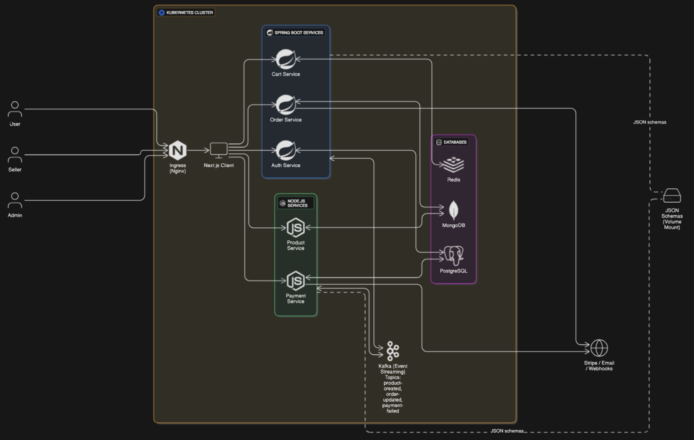

- Ingress Controller routes traffic to services based on paths
- Services communicate via **Kafka events** and **REST APIs**
- Each service manages its own database (polyglot persistence)
- Kafka decouples communication and enables horizontal scaling
- CI/CD and testing pipelines run through GitHub Actions
- Entire system is deployed and scaled on **Google Kubernetes Engine (GKE)**

---

### Kubernetes Cluster Layout

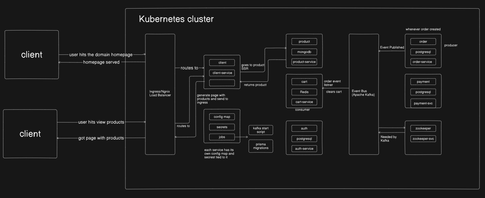

- Fully containerized setup using **Docker**
- **NGINX Ingress Controller** handles routing for `levomart.local`
- Kafka + Zookeeper deployed inside cluster
- Skaffold manages dev iterations with auto rebuild/deploy
- ConfigMaps and Secrets handle env variables per service
- Kubernetes Jobs trigger initialization tasks (like Kafka topic creation)
- Cluster hosted on **GCP's GKE**, leveraging autoscaling and managed infra

### CI/CD Layout

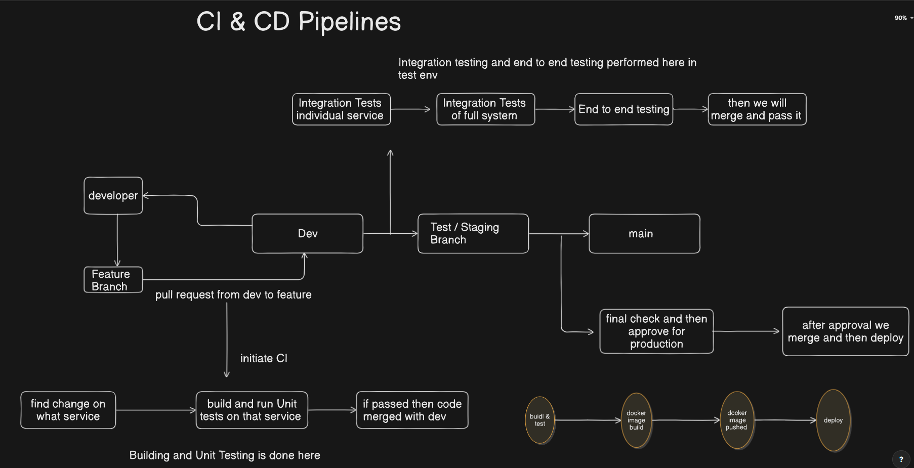

---

### Kafka Layout

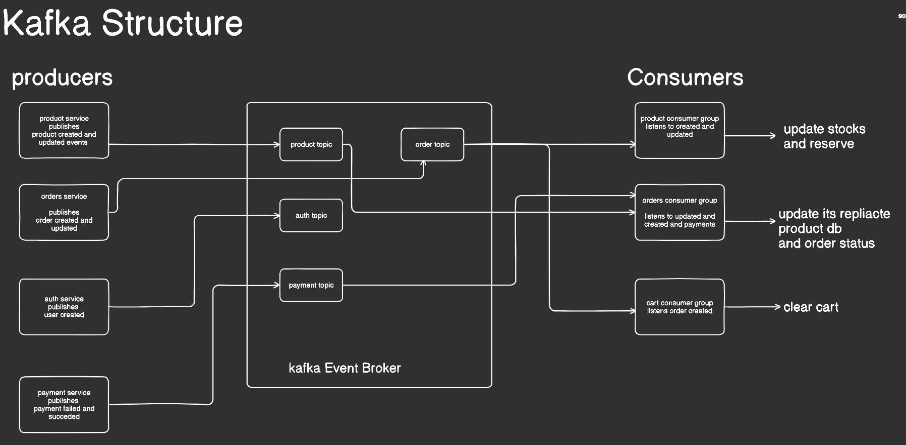

---

## 🏦 Microservices Overview

| Service             | Stack & Description                                      |
| ------------------- | -------------------------------------------------------- |
| **auth-service**    | Spring Boot + PostgreSQL. JWT Auth, roles, secure login  |
| **product-service** | Node.js + MongoDB. Product CRUD + Kafka producer         |
| **cart-service**    | Spring Boot + Redis. Sessionless cart logic              |
| **order-service**   | Node.js + PostgreSQL + Prisma. Order flow + Kafka        |
| **payment-service** | Spring Boot + Stripe. Secure checkout + webhook listener |
| **client**          | Next.js frontend (SSR/CSR hybrid)                        |

---

## 🏐 API Documentation (Swagger/OpenAPI)

- Swagger UI is integrated for all services
- Enables self-documented, explorable APIs

---

## 🚀 CI/CD Pipeline

- GitHub Actions on PRs and merges (feature &gt; dev &gt; test &gt; main)
- Unit & integration testing + Jacoco coverage badge
- Docker image build & GCR publish
- Optional deployment via **Google Cloud Build**
- Reusable workflows per service

---

## 🏡 UI Screenshots

# Homepage

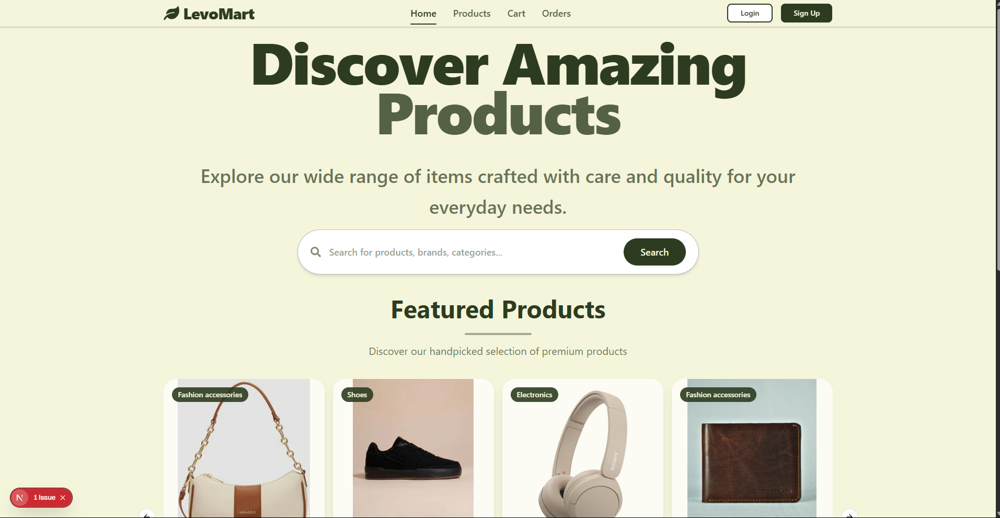

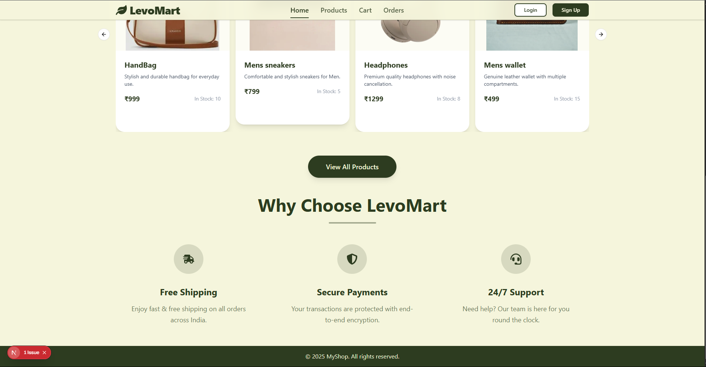

| Product Page                                            | Cart Page                                        |
| ------------------------------------------------------- | ------------------------------------------------ |
| 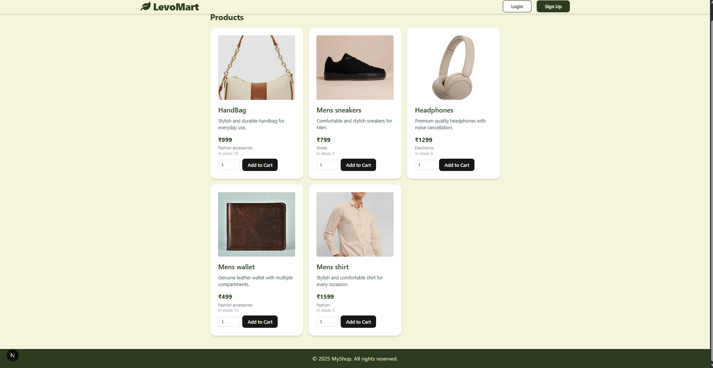 | 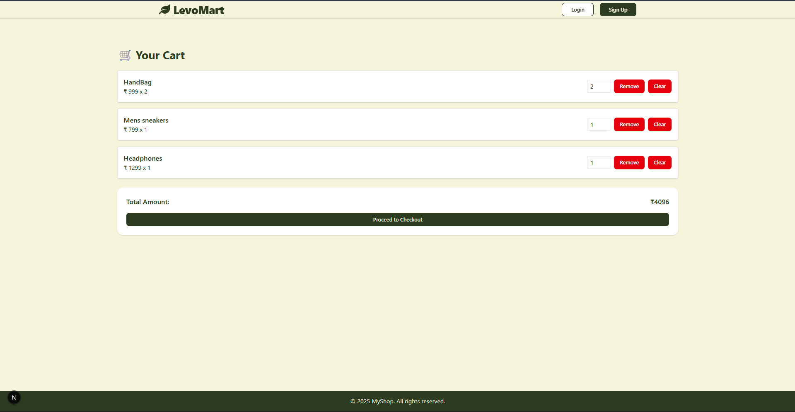 |

| Orders                                          | Seller Dash Board                                                  | Add product                                              |
| ----------------------------------------------- | ------------------------------------------------------------------ | -------------------------------------------------------- |
| 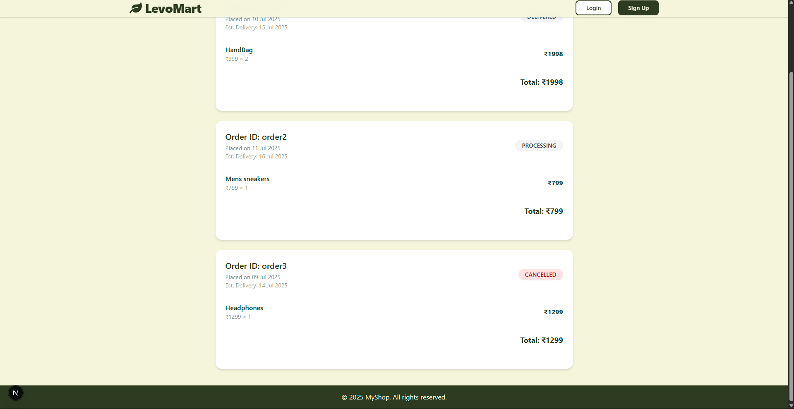 | 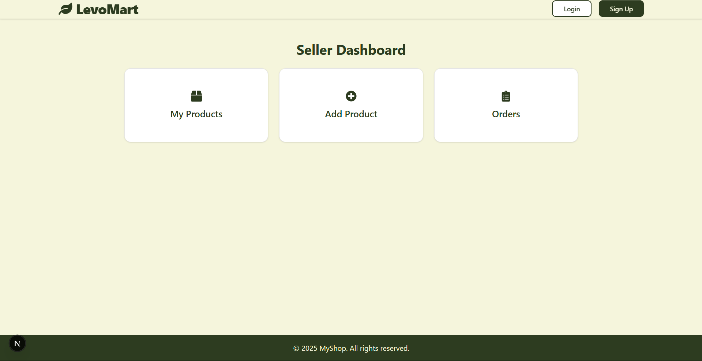 | 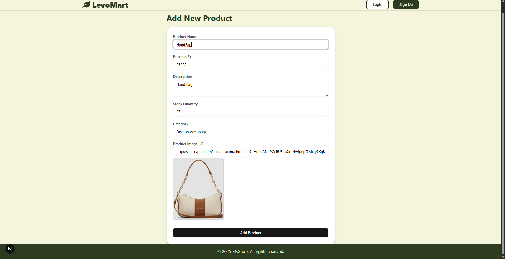 |

---

## 📂 Folder Structure

```bash
levomart/
├── auth/               # Spring Boot Auth Service
├── cart/               # Redis-backed Cart Service
├── product/            # Product CRUD Service (Node.js)
├── order/              # Kafka Order Service (Node.js)
├── payment/            # Stripe Integration (Spring Boot)
├── client/             # Next.js frontend
├── shared-schemas/     # Shared Kafka DTOs (JSON Schema)
├── k8s/                # Kubernetes manifests
├── cloudbuild.yaml     # Google Cloud Build
└── skaffold.yaml       # Skaffold Dev Config
└── docs                # Docs
└── notification/       # notification service

```

---

## 🤺 Setup & Development (GKE + Skaffold)

### Requirements for Local Install:

- Docker
- Kubernetes (GKE)
- Skaffold
- kubectl
- NGINX Ingress Controller

## 🧪 Local Setup & Development

### ✅ Requirements

- [Docker](https://www.docker.com/products/docker-desktop/)
- [Kubernetes](https://kubernetes.io/docs/setup/) (Minikube or Docker Desktop enabled)
- [Skaffold](https://skaffold.dev/docs/install/)
- [kubectl](https://kubernetes.io/docs/tasks/tools/)
- [NGINX Ingress Controller](https://kubernetes.github.io/ingress-nginx/)

---

### 🧑‍💻 Quick Start (Local)

```plaintext
# 1. Install Docker Desktop and enable Kubernetes

# 2. Install kubectl and Skaffold
brew install kubectl
brew install skaffold

# 3. Apply Ingress-NGINX Controller (for routing)
kubectl apply -f https://raw.githubusercontent.com/kubernetes/ingress-nginx/controller-v1.10.0/deploy/static/provider/cloud/deploy.yaml

# 4. Map hostname in /etc/hosts
sudo nano /etc/hosts

# Add this line to map levomart.local to localhost
127.0.0.1    levomart.local

# 5. Start local development with Skaffold
skaffold dev
```

> 💡 Skaffold will continuously build, watch, and redeploy your services in your local Kubernetes cluster. This can be resource-heavy — close other background apps if needed.

## 📖 API Documentation & Sample Usage

- All microservices expose REST APIs.
- **Swagger UI** is integrated and available for each service (e.g., `http://levomart.local/api/auth/swagger-ui.html`) for interactive API exploration and testing.

```plaintext
# Example: Get all products
GET /api/products

curl http://levomart.local/api/products
```

---

## ✅ Testing & Code Coverage

```plaintext
# Spring Boot Microservices
./mvnw test

# Frontend (Next.js)
cd client && npm run test
```

- Tests include unit and integration layers.
- **Jacoco** is used for code coverage reports.
- Coverage and test results are automatically reported in **GitHub Pull Requests** via CI workflows.

---

## 🛣️ Roadmap

Planned features and improvements:

---

## 👋 Contact

Built with ❤️ by [**Rajan Bansal**](https://www.linkedin.com/in/rajanbansal553/)  
📫 Let’s connect if you’re hiring, collaborating, or just passionate about distributed systems, backend engineering, or DevOps.

---

## 📝 License

Released under the MIT License.
